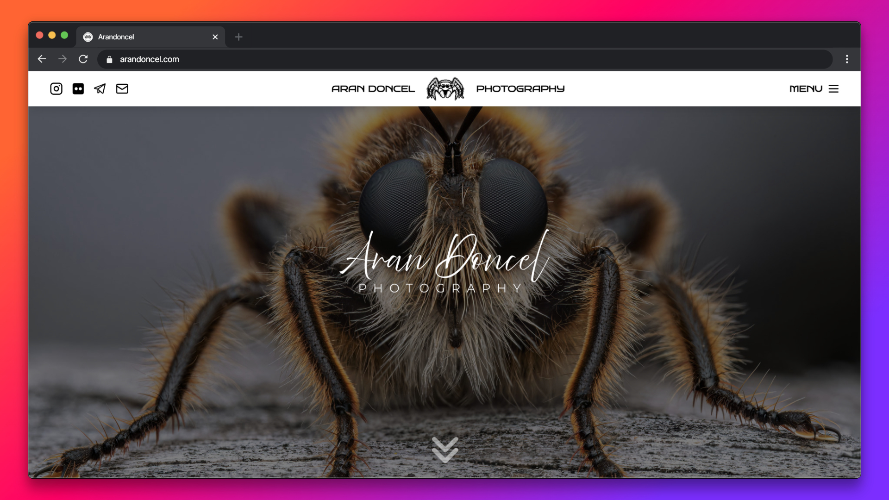

<div align="center">

# AranDoncel.com



**A clean and minimalist portfolio website for a professional photographer, built with Next.js and Tailwind CSS.**

[Live demo](https://arandoncel.com)

</div>

## 📖 Overview

This project is a responsive and minimalistic portfolio site for a professional photographer.

It was designed to showcase the client's best work through a clean UI, smooth animations, and a modern photo gallery with lightbox functionality.

## 📸 What's Included

- A fullscreen hero with background image and signature.
- An “About Me” section with a short bio of the photographer.
- A photo gallery with lightbox interaction.
- Contact and social media links.
- Smooth page transitions and scroll effects.
- Responsive design.

## 🛠️ Built With

- [Next.js](https://nextjs.org/)
- [Tailwind CSS](https://tailwindcss.com/)
- [Motion](https://motion.dev/)
- [React Photo Album](https://react-photo-album.com/)
- [Yet Another React Lightbox](https://yet-another-react-lightbox.com/)

## ⚙️ Setup Guide

You will need `node.js` and `git` installed globally on your machine.

1. Clone the repository:

   ```bash
   git clone https://github.com/yourusername/project-name.git
   ```

2. Install dependencies:
   
   ```bash
   cd project-name
   npm install
   ```

3. Run the development server:

   ```bash
   npm run dev
   ```

Open http://localhost:3000 to view it in the browser.

---

<div align="center">

[MIT License](https://github.com/leknod/arandoncel-com/blob/main/LICENSE) | [MarcDoncel.com](https://marcdoncel.com)

</div>